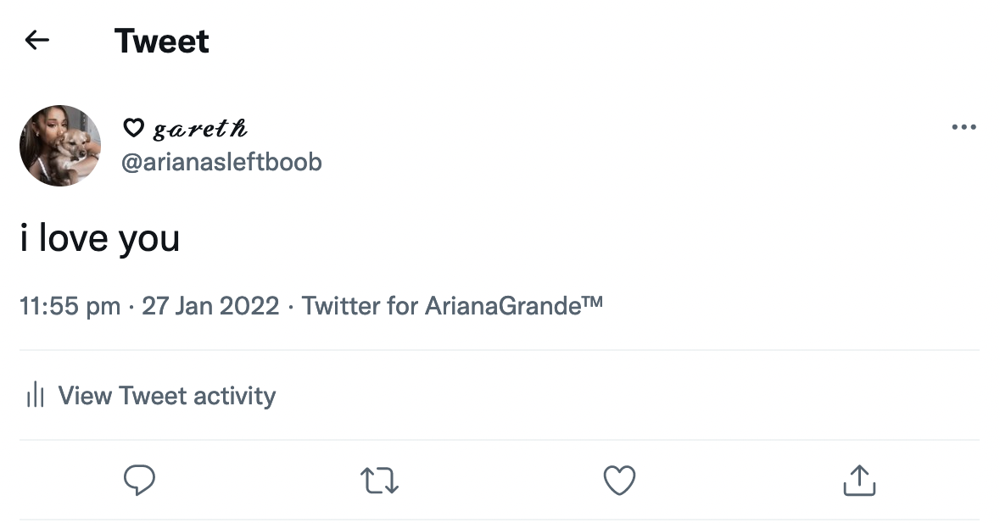
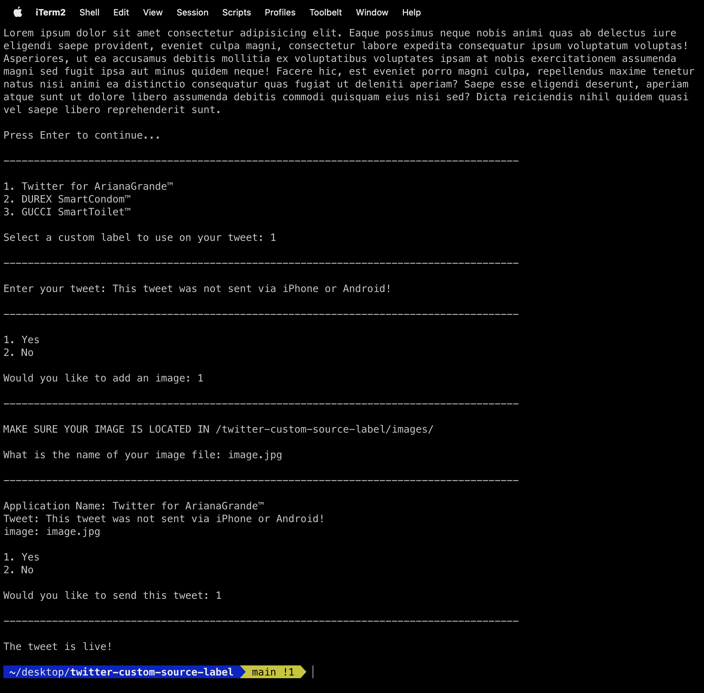

## README

Before you are able to use this software you need to have a verified twitter developer account.\
To acheive this just navigate to [Twitter Developer Platform](https://developer.twitter.com/) and fill out the application form.

## Creating A Twitter Application

- [x] Head over to [Twitter Developer Platform](https://developer.twitter.com/en/portal/projects-and-apps) and select "Create App".
- [x] Give your app a name, this is the name that will be shown on your tweets as the source label.
- [x] You will be redirected to API keys and Tokens, scroll down and click on “App Settings” to make few tweaks.
- [x] Scroll to App Permissions and change the option from “Read” to “Read and Write” and click on Save.
- [x] Scroll to Authentication Settings and turn on 3rd party authentication then click on Save.
- [x] Scroll to the top, and click on "Keys and Tokens" here you can see your Twitter API keys and Access Tokens.
- [x] Click on "Regenerate" for API Key & Secret then take a note of both Keys.
- [x] Click on "Generate" for Access Token & Secret then take a note of both Tokens.

## Setting Up The Software

- [x] At the top of this page select the green "Code" button and click "Download ZIP".
- [x] Extract the contents of the ZIP file to a folder called "twitter-custom-source-label".
- [x] Inside "twitter-custom-source-label", open "rewrite.py" in your IDE or Text Editor.
- [x] On line 9 set the value of "Application Name" to your application name and Save.
- [x] On lines 10, 11, 12 and 13 add the API keys and Access Tokens that you made a note of.
- [x] Open Terminal and navigate to the "twitter-custom-source-label".
- [x] Run the commands `pip install -r requirements.txt` then `python3 rewrite.py`.

## License

This project is under the MIT license. See [LICENSE](./LICENSE) for more details.

## Preview

